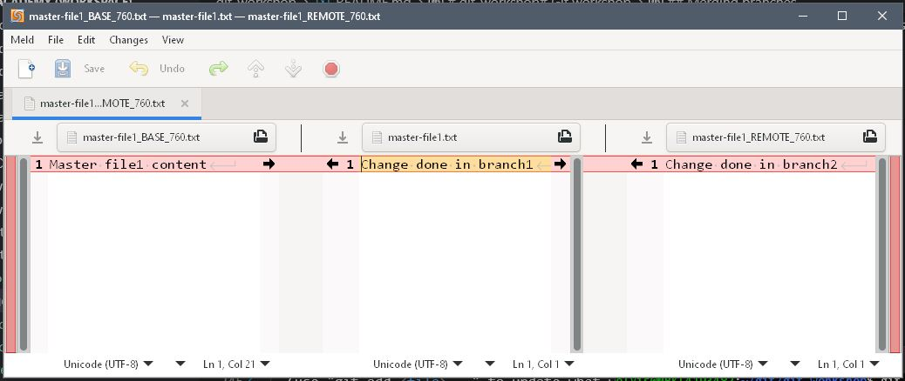

# git-workshop# Git workshop

## Initializing/cloning Git repository

To start working with Git a repository needs to be created or cloned. In a work directory run the following command. It is assumed that _~/git_ is a working directory for the Git workshop.

```bash
cd ~/git/
git init test-repo
ls -al test-repo/
ls -al test-repo/.git/
cd test-repo/
git status
```

You should see the following output

        Initialized empty Git repository in /mnt/c/devel/git/test-repo/.git/

You can list directory content and see the content of an empty repository:

        :~/git$ ls -al test-repo/
        total 0
        drwxrwxrwx 1 elvis elvis 512 Aug 29 14:06 .
        drwxrwxrwx 1 elvis elvis 512 Aug 29 14:06 ..
        drwxrwxrwx 1 elvis elvis 512 Aug 29 14:06 .git
        :~/git$ ls -al test-repo/.git/
        total 0
        drwxrwxrwx 1 elvis elvis 512 Aug 29 14:06 .
        drwxrwxrwx 1 elvis elvis 512 Aug 29 14:06 ..
        -rwxrwxrwx 1 elvis elvis  23 Aug 29 14:06 HEAD
        drwxrwxrwx 1 elvis elvis 512 Aug 29 14:06 branches
        -rwxrwxrwx 1 elvis elvis 112 Aug 29 14:06 config
        -rwxrwxrwx 1 elvis elvis  73 Aug 29 14:06 description
        drwxrwxrwx 1 elvis elvis 512 Aug 29 14:06 hooks
        drwxrwxrwx 1 elvis elvis 512 Aug 29 14:06 info
        drwxrwxrwx 1 elvis elvis 512 Aug 29 14:06 objects
        drwxrwxrwx 1 elvis elvis 512 Aug 29 14:06 refs
        :~/git$ cd test-repo/
        :~/git/test-repo$ git status
        On branch master

        No commits yet

        nothing to commit (create/copy files and use "git add" to track)


However this repos contains only empty indexes so in order to proceed with workshop tasks wthout creating buch of files and branches yourself, please clone existing example repository.

```bash
cd ~/git/
git clone https://github.com/centric-lt/git-workshop.git
cd git-workshop
```

You should see similar output:

        :~/git/git-workshop$ git clone https://github.com/centric-lt/git-workshop.git
        Cloning into 'git-workshop'...
        remote: Enumerating objects: 3, done.
        remote: Counting objects: 100% (3/3), done.
        remote: Total 3 (delta 0), reused 0 (delta 0), pack-reused 0
        Unpacking objects: 100% (3/3), 587 bytes | 6.00 KiB/s, done.

## Adding changes

Working with Git repository is ususally defined via the following action loop:

1. Pull latest content from remote and merge changes to your branch
2. Update file(s)
3. Add files to a commit
4. Commit files to a branch
5. Push changes to the remote location
6. Repeat. :)

### Change files and see differencies

Initial _master_ branch should contain the following files:

        master-file1.txt
        master-file2.txt

Update file content by adding some symbols and save the files. Running ``git status`` should now show something similar.

        :~/git/git-workshop$ git status
        On branch main
        Your branch is up to date with 'origin/main'.

        Changes not staged for commit:
        (use "git add <file>..." to update what will be committed)
        (use "git restore <file>..." to discard changes in working directory)
                modified:   master-file1.txt
                modified:   master-file2.txt

        no changes added to commit (use "git add" and/or "git commit -a")

To review changes before commiting them, run ``git diff``. Terminal should show similar output:

```diff
diff --git a/master-file1.txt b/master-file1.txt
index f0e8800..fe81363 100644
--- a/master-file1.txt
+++ b/master-file1.txt
@@ -1 +1,3 @@
 Master file1 content
+Change to master-file1
+Change to master-file1
diff --git a/master-file2.txt b/master-file2.txt
index fa8988f..8b33cf1 100644
--- a/master-file2.txt
+++ b/master-file2.txt
@@ -1 +1,2 @@
 Master file2 content
+Change to master-file2
```

### Add changes to commit

To add changes to a Git repository, sdd the files to the commit and commit with the commit message. If message option is omitted, then an interactive text exitor session is started. After commit message is saved and editor closed a temporary file content is added to a commit. An interactive session might be required to create more detailed muiltiline commit message.

```bash
git add master-file*
git commit -m "Updating master files"
```

### Viewing the change log

Git stores all the changes in it's database and these changes can be reviewed at any time. A ``git log`` and ``git show`` commands with appropriate parameters is used to review changes.

```bash
git log
git log -p
git show commit_ID
```

## Working with branches and stash

Git supports working with several workstreams in the same time period. Obviously only one branch can be active at the given moment, but branches can be easily switched. Also Git provides temporary storage for not yet ready to commit changes. It can also be used as a kind of clipboard to move changes between branches.

To store changes in a temporary storage use ``git stash`` command. For example we have file changes, which are not ready for commit but we need to switch branch and do changes in another branch and we do not want to loose changes in current branch.

        :~/git/git-workshop$ git status
        On branch main
        Your branch is up to date with 'origin/main'.

        Changes not staged for commit:
        (use "git add <file>..." to update what will be committed)
        (use "git restore <file>..." to discard changes in working directory)
                modified:   master-file1.txt
                modified:   master-file2.txt

        no changes added to commit (use "git add" and/or "git commit -a")

To save those changes we can stash them:

```bash
git stash
git stash list
```

        :~/git/git-workshop$ git stash
        Saved working directory and index state WIP on main: c69444c Initial commit of master-files to master branch
        :~/git/git-workshop$ git stash list
        stash@{0}: WIP on main: c69444c Initial commit of master-files to master branch

After changes have been stashed a branch can be checked out using ``git checkout``. If new branch is required, then option ``-b`` should be used to create new branch.

```bash
git checkout -b branch1
git checkout branch2
git checkout -b branch2
git branch --list
git branch -a
```

If _branch2_ is not a name of an existing branch, you should see something like this

        :~/git/git-workshop$ git checkout -b "branch1"
        Switched to a new branch 'branch1'
        :~/git/git-workshop$ git checkout main
        M       README.md
        Switched to branch 'main'
        Your branch is up to date with 'origin/main'.
        :~/git/git-workshop$ git checkout "branch2"
        error: pathspec 'branch2' did not match any file(s) known to git
        :~/git/git-workshop$ git checkout -b "branch2"
        Switched to a new branch 'branch2'
        :~/git/git-workshop$ git branch --list
        * branch1
        branch2
        main
        :~/git/git-workshop$ git branch -a
        * branch1
        branch2
        main
        remotes/origin/HEAD -> origin/main
        remotes/origin/branch1
        remotes/origin/branch2
        remotes/origin/main

After changes have been done to branch1 and/or branch2, previously stashed changes can be retrieved and applied back to master branch. Stash can contain multiple stacked active work items and are retrieved from the top, unless specific stack item is referenced. If stash item can be applied to current branch without any merge conflicts, item is dropped from stash. If there are issues with stash item merge it will remain in the stash and will have to be removed explicitly.

```
git checkout main
git stash list
git stash pop stash@{0}
```


        :~/git/git-workshop$ git stash list
        stash@{0}: WIP on main: c69444c Initial commit of master-files to master branch
        :~/git/git-workshop$ git stash pop stash@{0}
        On branch main
        Your branch is up to date with 'origin/main'.

        Changes not staged for commit:
        (use "git add <file>..." to update what will be committed)
        (use "git restore <file>..." to discard changes in working directory)
                modified:   README.md
                modified:   master-file1.txt
                modified:   master-file2.txt

        no changes added to commit (use "git add" and/or "git commit -a")
        Dropped stash@{0} (0bed5a8be7082043246b08a5f7a2e0309e260bb7)

## Merging branches

While workstreams can be done in dedicated branches, at some point those changes needs to be merged back to the origin branch as release is usually (not always!) done from the origin branch. Also, sometimes several workstreams needs to be merged too. For change merging ``git merge`` is used. And where are code merge, there is merge conflict.

Checkout _branch1_ and try to merge changes from _main_ and _branch2_.

```bash
git config -l | grep -E "merge.?tool"
git status
git merge main
git merge branch2
```

The output should be something like this

        :~/git/git-workshop$ git config -l | grep -E "merge.?tool"
        merge.tool=meld
        mergetool.meld.cmd=meld --diff "$BASE" "$LOCAL" "$REMOTE" --output "$MERGED"

        :~/git/git-workshop$ git status
        On branch branch1
        Your branch is up to date with 'origin/branch1'.

        Changes not staged for commit:
        (use "git add <file>..." to update what will be committed)
        (use "git restore <file>..." to discard changes in working directory)
                modified:   README.md

        no changes added to commit (use "git add" and/or "git commit -a")
        :~/git/git-workshop$ git merge main
        Already up to date.
        :~/git/git-workshop$ git merge branch2
        Auto-merging master-file1.txt
        CONFLICT (content): Merge conflict in master-file1.txt
        Automatic merge failed; fix conflicts and then commit the result.
        :~/git/git-workshop$ git mergetool
        Merging:
        master-file1.txt

        Normal merge conflict for 'master-file1.txt':
        {local}: modified file
        {remote}: modified file

Specific visual, how merge conflict resolution does look like depends on the editor specified in ``merge.tool`` configuration option.



## Reverting changes

There are times, when changes needs to be reverted. For such actions ``git reset`` and ``git revert`` commands are usually used. For more finegrained reverts a specific file checkout can be used. Also reverting changes depends on whether changes were already committed to branch or not.


```
git checkout main
git checkout -- master-file1.txt
git checkout main.
```

If there are uncommited changes to the files, which does exist in destination branch, git will refuse to change branches as data loss will occur.

        :~/git/git-workshop$ git checkout main
        error: Your local changes to the following files would be overwritten by checkout:
                master-file1.txt
        Please commit your changes or stash them before you switch branches.
        Aborting
        :~/git/git-workshop$ git checkout -- master-file1.txt
        :~/git/git-workshop$ git checkout main
        M       README.md
        Switched to branch 'main'
        Your branch is up to date with 'origin/main'.

To clear branch state while changes are not yet committed ``git reset``can be used. Depending on the parameters used, _reset_ will either removes changes from commit or removes changes from the files themselves.

```
echo "CHANGE" >> branch2-file1.txt
echo "CHANGE" >> branch2-file2.txt
echo "CHANGE" >> README.md
git add branch2-file1.txt
git status
git reset
git status
git reset --hard
```


        :~/git/git-workshop$ git add branch2-file1.txt
        :~/git/git-workshop$ git status
        On branch main
        Your branch is up to date with 'origin/main'.

        Changes to be committed:
        (use "git restore --staged <file>..." to unstage)
                new file:   branch2-file1.txt

        Changes not staged for commit:
        (use "git add <file>..." to update what will be committed)
        (use "git restore <file>..." to discard changes in working directory)
                modified:   README.md

        Untracked files:
        (use "git add <file>..." to include in what will be committed)
                branch2-file2.txt
                master-file1.txt.orig

        :~/git/git-workshop$ git reset
        Unstaged changes after reset:
        M       README.md
        :~/git/git-workshop$ git status
        On branch main
        Your branch is up to date with 'origin/main'.

        Changes not staged for commit:
        (use "git add <file>..." to update what will be committed)
        (use "git restore <file>..." to discard changes in working directory)
                modified:   README.md

        Untracked files:
        (use "git add <file>..." to include in what will be committed)
                branch2-file1.txt
                branch2-file2.txt
                master-file1.txt.orig

        no changes added to commit (use "git add" and/or "git commit -a")

        :~/git/git-workshop$ git reset --hard
        HEAD is now at 11e0209 README updated with workshop commands
        :~/git/git-workshop$ git status
        On branch main
        Your branch is up to date with 'origin/main'.

        Untracked files:
        (use "git add <file>..." to include in what will be committed)
                branch2-file1.txt
                branch2-file2.txt
                master-file1.txt.orig

        nothing added to commit but untracked files present (use "git add" to track)

However ``git reset`` does not remove files themselves. Git will show untracked files and leave them while switching branches as is unless the file with the same name is tracked in another branch. To remove untracked files a different Git command ``git clean`` is used.

```bash
git clean -n
git clean -f
```

## Working with remotes

After changes are done locally they need to be shared with other team members or at least provided to upstream for the build/release process to be started. To push changes upstream ``git push`` command should be used. Note, that while pulling from the repository can be done anonymously, pushing to the repository requires authentication, even if repository is public. How this is done, depends on the Git backend used.

Before changes can be pushed, updates to the branch have to be pulled and merged from remote via ``git pull`` or fetched via ``git fetch`` and explicitly merged to specific branch. There are situations, when automated merge is not desirable.


        :~/git/git-workshop$ git pull
        Already up to date.
        :~/git/git-workshop$ git push
        Enumerating objects: 7, done.
        Counting objects: 100% (7/7), done.
        Delta compression using up to 8 threads
        Compressing objects: 100% (4/4), done.
        Writing objects: 100% (5/5), 42.67 KiB | 970.00 KiB/s, done.
        Total 5 (delta 0), reused 0 (delta 0)
        To github.com:centric-lt/git-workshop.git
        c69444c..11e0209  main -> main

## Finding bug with git bisect

Branch ``bug-branch`` contains a two scripts, which have been broken at some point in time. In real life it woulg be hard to identify specific commit, which have broken ``main-script.sh`` and ``main-script.ps1`` as git log usually does not reflect bad commit and commit history may contain hundreds of the commits since bug was introduced. Using ``git bisect`` it is possible to shorten process of location of bad commit by using binary search algorithm.

To start searching for the bug a good commit needs to be identified. In this test case this is _50c86e0b76a308f3326b09bf1654b6061b7e3a4f_ commit, where our test workload script was added. Bad commit iun our case is latest branch commit. In real life an earliest release, where bug was identified should be used, so search scope can be narrowed. To imitate application test main-script.sh script will be run and exit code will be checked. A non 0 exit code will identify bad commit. The whole process would look like this:

1. Start bisect sesion by running ``git bisect start``
2. Checkout known _bad_ commit and mark it as such by running ``git bisect bad``
3. Mark known _good_ commit by running ``git bisect good COMMIT_ID`` or ``git commit good TAG``
4. Git will check out commit in between of those two and will promt how many search steps have left.
5. Run test to verify if commit at step 4 is good or bad.
6. According to test results run ``git bisect good`` or ``git bisect bad``
7. Git will check out another commit in between according to command in step 6.
8. Repeat from step 5 until Git will report: "Bisecting: 0 revisions left to test after this (roughly 0 steps)"

Screen output should look similar to this.

        :~/git/git-workshop$ git checkout bug-branch
        Switched to branch 'bug-branch'
        :~/git/git-workshop$ git bisect start
        :~/git/git-workshop$ git bisect bad
        :~/git/git-workshop$ git bisect good 50c86e0b76a308f3326b09bf1654b6061b7e3a4f
        Bisecting: 8 revisions left to test after this (roughly 3 steps)
        [9b439c21fb32220a173e2ab50241c0ac5c49da00] POwershell test script added
        :~/git/git-workshop$ bash main-script.sh && echo "GOOD" || echo "BAD"
        This is an example of working code
        Linux NBKL4193482 5.10.102.1-microsoft-standard-WSL2 #1 SMP Wed Mar 2 00:30:59 UTC 2022 x86_64 x86_64 x86_64 GNU/Linux
        NBKL4193482.clt.lt.centric.lan
        Additional command moved down
        GOOD
        :~/git/git-workshop$ git bisect good
        Bisecting: 4 revisions left to test after this (roughly 2 steps)
        [f9b58f1ffd3988e8a940cdb3e5d253ffd003f766] Breaking Powershell script
        :~/git/git-workshop$ bash main-script.sh && echo "GOOD" || echo "BAD"
        This is an example of working code
        Linux NBKL4193482 5.10.102.1-microsoft-standard-WSL2 #1 SMP Wed Mar 2 00:30:59 UTC 2022 x86_64 x86_64 x86_64 GNU/Linux
        NBKL4193482.clt.lt.centric.lan
        Additional command moved down
        Printing finish line
        main-script.sh: line 10: eco: command not found
        BAD
        :~/git/git-workshop$ git bisect bad
        Bisecting: 1 revision left to test after this (roughly 1 step)
        [1a960e8945227cf16f0ac05776f3abd5a39bef58] Fixing Powershell test script
        :~/git/git-workshop$ bash main-script.sh && echo "GOOD" || echo "BAD"
        This is an example of working code
        Linux NBKL4193482 5.10.102.1-microsoft-standard-WSL2 #1 SMP Wed Mar 2 00:30:59 UTC 2022 x86_64 x86_64 x86_64 GNU/Linux
        NBKL4193482.clt.lt.centric.lan
        Additional command moved down
        GOOD
        :~/git/git-workshop$ git bisect good
        Bisecting: 0 revisions left to test after this (roughly 0 steps)
        [0e8d316afb3a8a06082659e684c593adbf12b853] Adding finish line to main script BAD


### An example of an automated search
In real life this most likely would be some release tag. Next step is to make a copy of a test script as this script is part of repository and it does not exist in earlier commits

